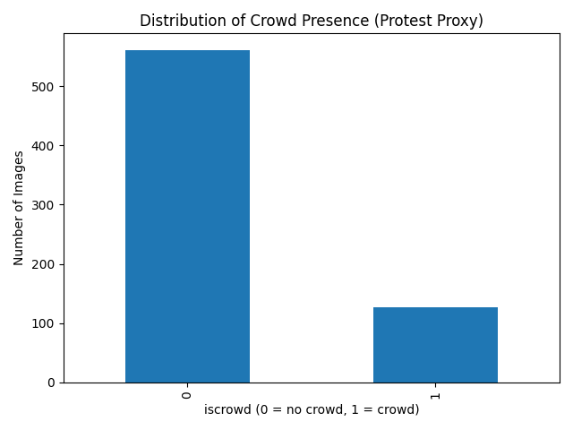
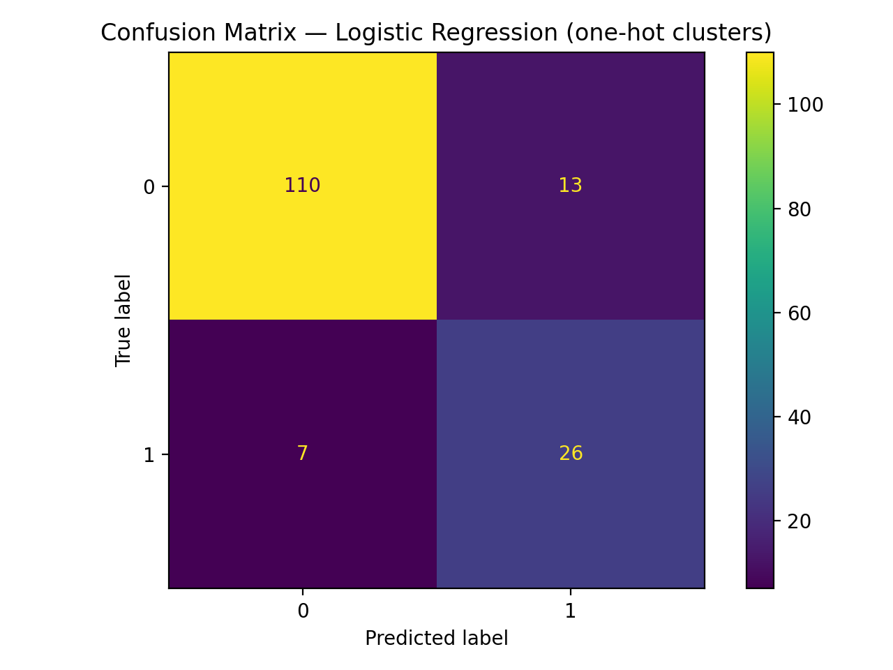
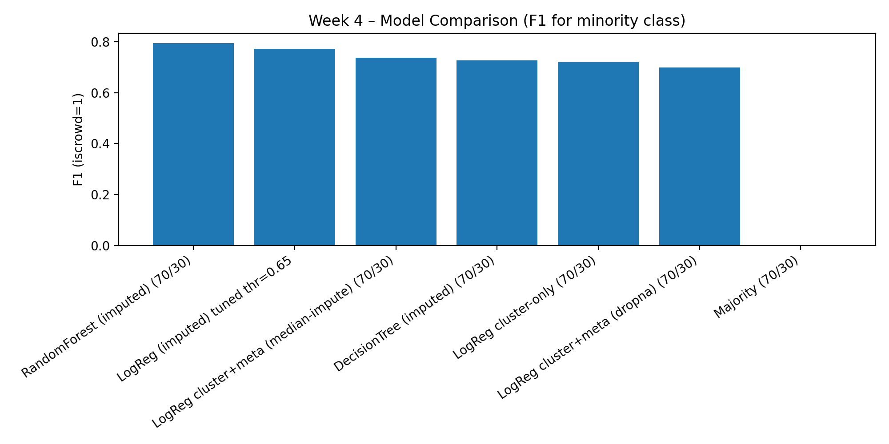
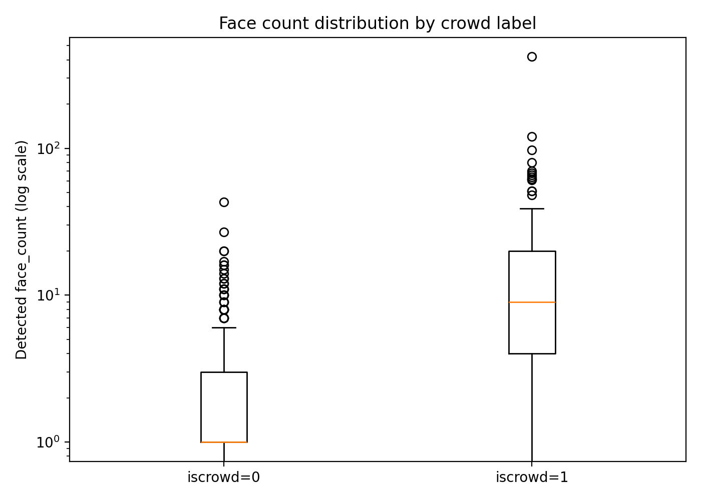
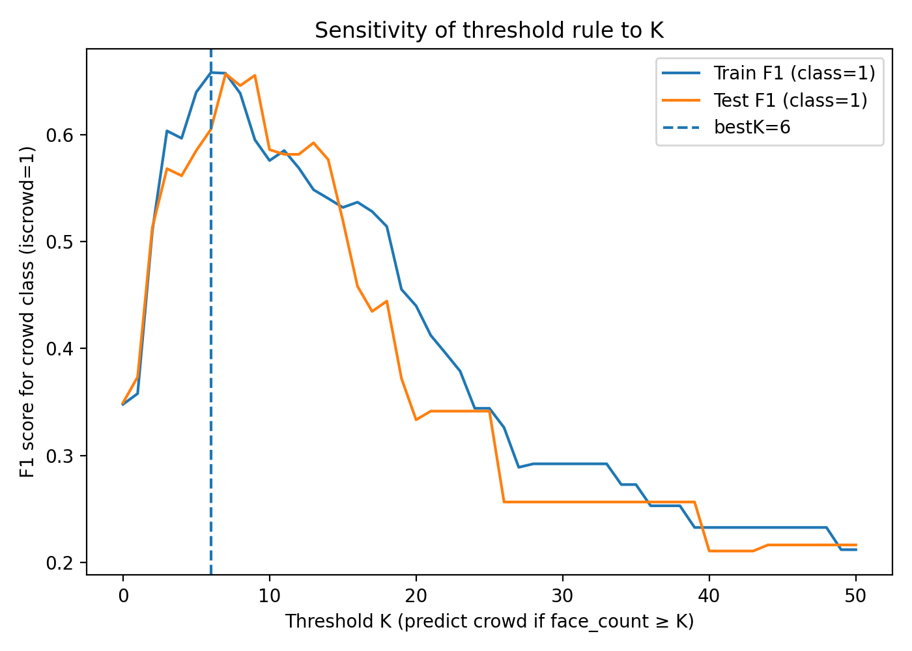
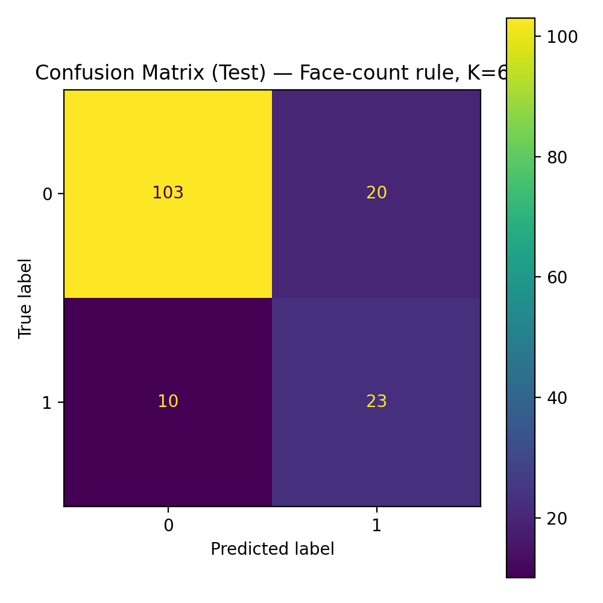
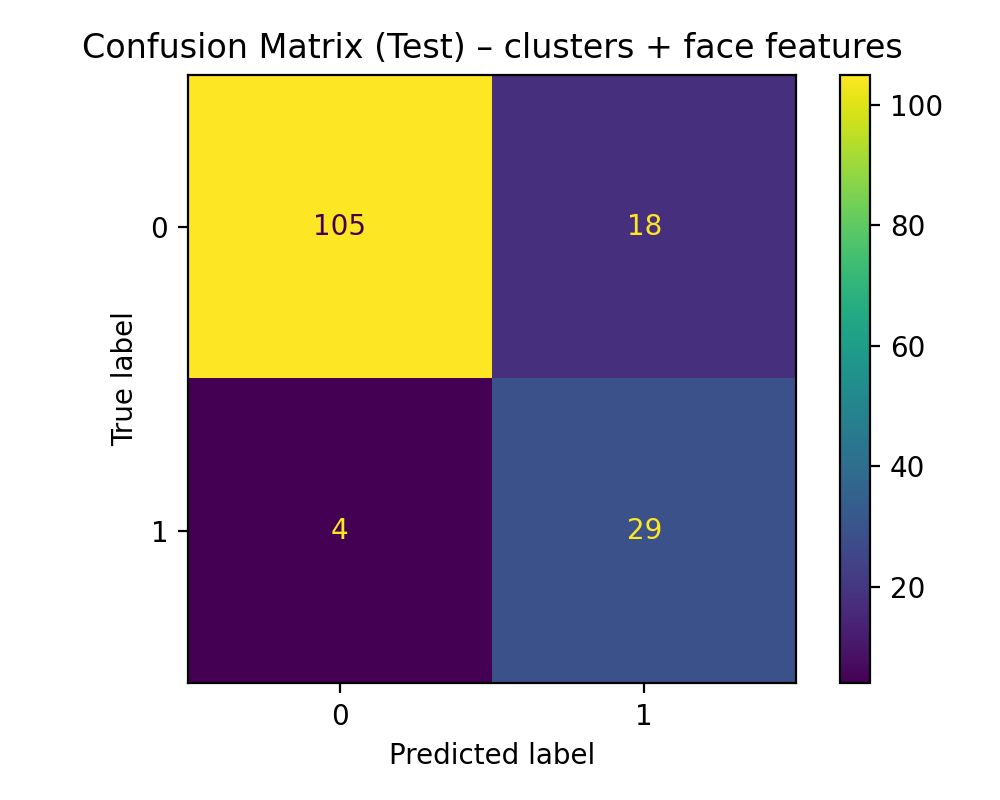

# Predicting Crowd Presence in News Images

## Project Overview

This project examines whether machine-learning models can measure visible crowd presence in news images as a component of visual framing.

The target variable (`iscrowd`) indicates whether an image contains a visible crowd. Importantly, this is **not a protest classifier**. The model predicts crowd presence as a visual proxy and does not distinguish protest crowds from other types of gatherings.

We evaluate whether **face-derived visual features** add predictive signal beyond an **unsupervised cluster-based image representation**.

## Live Report (GitHub Pages)
- **Report URL:** https://TemurAkhtamjonov.github.io/STATS201_project/
- **Repo:** https://github.com/TemurAkhtamjonov/STATS201_project

## Project Snapshot

This project investigates whether image-derived features can predict visible crowd presence in a corpus of news images.

The final interpretable model combines unsupervised visual cluster labels with face-derived features extracted using MTCNN. Adding face information increased recall for crowd images from **0.788** to **0.879**, while slightly reducing precision and overall accuracy.

This result illustrates an important precision-recall trade-off: the extended model identifies more true crowd images, but also produces more false positives.

### Key Lessons

- Machine-learning performance depends on how a social-science concept is operationalized, not only on model choice.
- Face count is an interpretable but noisy proxy for crowd visibility.
- Error analysis is necessary because distant crowds, occlusion, collages, posters, and screens can systematically mislead face-detection models.
- Reproducibility, theoretical justification, and clear communication are as important as obtaining a working classifier.

### Future Improvements

Future versions of this project could:

- compare alternative operationalizations of crowd visibility;
- evaluate model stability using repeated stratified splits or cross-validation;
- test generalization on an independent news-image dataset;
- reduce dependence on corpus-specific unsupervised cluster labels;
- improve the final report's visual and editorial polish.

### Individual Contribution

Although the course project allowed groups of up to three students, I completed the implementation, experimentation, analysis, documentation, and repository development independently.

## Research Question
- **Substantive:** How can we measure **crowd presence** as a component of visual framing in a large corpus of news images?
- **Operational:** Can image-derived representations predict whether an image contains a crowd (`iscrowd`)?

## Machine Learning Task
We frame the problem as **binary classification**:

- **Target (y):** `iscrowd` (1 = visible crowd present)
- **Inputs (X):**
  - Baseline representation: `predicted_labels` (unsupervised image cluster ID)
  - Extended representation (final model): `predicted_labels` + face-derived features (`face_count`, `face_count_hi`, `max_face_prob`)

Because the label is imbalanced, we report metrics beyond accuracy (Precision/Recall/F1 for class 1).

## Data Source
Replication data from:
Torres (2024). *A Framework for the Unsupervised and Semi-Supervised Analysis of Visual Frames*.

Key files used:
- `capsule/data/metadata_caravan_media_short.csv` (includes `iscrowd`)
- `capsule/data/clusters_preds_caravan_newsapi.csv` (image file → `predicted_labels`)
- `capsule/data/Images2/` (images used for face detection)

## Repository Structure
- `notebooks/` — weekly notebooks + final model notebook
- `figures/` — figures used in the report/presentation
- `report/` — source report notebook (`final_report.ipynb`)
- `docs/` — rendered HTML for GitHub Pages (`index.html` + assets)
- `requirements.txt` — dependencies

## Weekly Progress (Archive)
The sections below summarize weekly milestones and experiments completed during the project.

<details>
<summary><strong>Week 2 — Feasibility + Data Understanding</strong></summary>

### What we did
1. Loaded metadata and inspected columns  
2. Examined label distribution for `iscrowd`  
3. Confirmed class imbalance and dataset size  

### Output


</details>

<details>
<summary><strong>Week 3 — Baseline Models & Evaluation</strong></summary>

### Data merge
We merged metadata with cluster predictions on `imageid`:
- Metadata rows: **688**
- Matched rows after merge: **517**

This means Week 3 baselines are trained/evaluated on **517** images that appear in both files.

### Train/Test split
We used a **stratified 70/30 split** to preserve class proportions:
- `test_size=0.30`, `random_state=42`, `stratify=y`

### Baseline models implemented
1. **Majority class baseline**
   - Predicts the most common label for every example.
2. **Cluster-rate baseline**
   - Estimates `P(y=1 | cluster)` on train, predicts 1 if probability ≥ 0.5.
3. **Logistic regression baseline**
   - One-hot encodes `predicted_labels`
   - Logistic regression with `class_weight="balanced"`

### Evaluation metrics
We report:
- Accuracy
- Confusion matrix
- **F1 score (class 1)**
- **Balanced accuracy**
- **ROC-AUC** (when probabilities available)
- 5-fold CV F1 (StratifiedKFold)

### Results (Week 3)
| Model | Accuracy | F1 (class 1) | Balanced Acc | ROC-AUC | Notes |
|---|---:|---:|---:|---:|---|
| Majority baseline | 0.788 | 0.000 | 0.500 | N/A | Predicts all 0 |
| Cluster-rate baseline | 0.872 | 0.722 | 0.841 | N/A | Uses train cluster rates |
| Logistic (one-hot clusters, balanced) | 0.872 | 0.722 | 0.841 | 0.895 | Uses `predicted_labels` |

Confusion matrix (logistic): TN=110, FP=13, FN=7, TP=26  


5-fold CV (StratifiedKFold) F1 mean: 0.717 (std: 0.067)

</details>

<details>
<summary><strong>Week 4 — Feature Construction & Model Comparison</strong></summary>

### Goal
Compare multiple representations/models for predicting `iscrowd` using the Torres replication data.

### Features
- Base: `predicted_labels`
- Extended: `predicted_labels + newspaperid + ideol_allsides + topicality`  
  (compare dropna vs median-imputation for `topicality`)

### Models Compared (70/30 split, stratified, random_state=42)
- Majority-class baseline
- Logistic Regression (cluster-only)
- Logistic Regression (cluster + metadata, dropna)
- Logistic Regression (cluster + metadata, median-imputed)
- Decision Tree (median-imputed)
- Random Forest (median-imputed)
- Logistic Regression with **threshold tuning** (optimize F1 for class 1)

### Key Results (class 1 = `iscrowd`)
| Model | Acc | Prec_1 | Rec_1 | F1_1 |
|---|---:|---:|---:|---:|
| RandomForest (imputed) | 0.910 | 0.771 | 0.818 | 0.794 |
| LogReg (imputed) tuned thr=0.65 | 0.897 | 0.730 | 0.818 | 0.771 |
| LogReg cluster+meta (median-impute) | 0.872 | 0.651 | 0.848 | 0.737 |
| LogReg cluster-only | 0.872 | 0.667 | 0.788 | 0.722 |
| DecisionTree (imputed) | 0.865 | 0.636 | 0.848 | 0.727 |
| LogReg cluster+meta (dropna) | 0.862 | 0.647 | 0.759 | 0.698 |
| Majority baseline | 0.788 | 0.000 | 0.000 | 0.000 |



Notebook: `notebooks/week4.ipynb`

</details>

<details>
<summary><strong>Week 5 — Diagnostics, Errors, Robustness (Image-Based Analysis)</strong></summary>

### Goal
**Diagnose model behavior and failure modes** by introducing an explicit image-based representation and evaluating its robustness. Unlike earlier weeks, which relied on precomputed visual clusters and metadata, this week directly processes raw images to extract an interpretable signal: **the number of detected faces in each image**.

### Image-Based Feature: Face Count
We applied a pretrained **MTCNN face detection model** to all available images (N = 517).  
For each image, we extracted the following features:

- `face_count`: total number of detected faces  
- `face_count_hi`: number of high-confidence detections  
- `max_face_prob`: maximum detection confidence in the image  



**Observation:**
- Images labeled `iscrowd = 1` exhibit substantially higher face counts on average.
- The distribution is highly skewed, with extreme outliers (up to 400+ faces).
- A log scale is required to visualize variability, indicating rare but very large gatherings.

This confirms that face count is a meaningful but noisy visual signal.

### Robustness Check: Threshold Sensitivity
Rule: predict `iscrowd=1` if `face_count ≥ K`.  

We swept thresholds K in [0, 50] and evaluated F1 score on both training and test splits.



**Observation:**
- Performance is highly sensitive to the choice of threshold K.
- The optimal threshold on the training set is **K = 6**.
- Performance degrades sharply for larger thresholds, revealing brittleness.

This highlights the instability of hard decision rules and motivates more flexible modeling approaches.

### Error Analysis: Confusion Matrix (K = 6)
Using the best-performing threshold K = 6, we evaluated test-set errors.



**Findings:**
- False positives often correspond to images with many visible faces but no labeled crowd (e.g., collages, repeated faces, studio audiences).
- False negatives include crowd scenes where faces are small, occluded, or viewed from a distance.

This demonstrates that face count alone cannot reliably capture crowd semantics.

### Failure Modes and Bias
Key failure modes identified:
- **Overcounting:** repeated faces, posters, or screens inflate face counts.
- **Undercounting:** distant or occluded crowds yield few detections.
- **Context blindness:** face count ignores spatial layout and interaction between people.

These issues highlight how naive visual heuristics can encode systematic bias.

### Implications and Next Steps
Week 5 diagnostics show that:
- Image-based features provide strong, interpretable signals.
- Simple rules are brittle and sensitive to parameter choice.
- Error analysis reveals where visual heuristics fail semantically.

</details>

<details>
<summary><strong>Week 6 — Final Model (Updated: clusters + faces)</strong></summary>

**Note on metadata models (Week 4):** metadata improved performance, but the final model excludes metadata to keep the task visually grounded and aligned with `iscrowd`.

### Goal
Synthesize prior stages into a final, interpretable model for predicting `iscrowd` (crowd presence).

### Final Model Specification
The final model is a **logistic regression classifier** combining:

### Visual Representation
- `predicted_labels` (image cluster ID)

### Image-Based Features
- `face_count`
- `face_count_hi`
- `max_face_prob`

Processing steps:
- `predicted_labels` -> one-hot encoded
- Numeric face features -> passed through directly (missing filled with 0)
- 70/30 stratified train–test split (`random_state=42`)
- `class_weight="balanced"` to handle label imbalance

### Results (held-out test set)
| Model | Accuracy | Prec_1 | Rec_1 | F1_1 |
|---|---:|---:|---:|---:|
| Baseline (clusters only) | 0.8718 | 0.6667 | 0.7879 | 0.7222 |
| Final (clusters + faces) | 0.8590 | 0.6170 | 0.8788 | 0.7250 |

Interpretation:
- Face features **increase recall** (more crowd images detected) and slightly increase F1.
- Precision and overall accuracy decrease slightly, indicating a recall–precision trade-off.

**Confusion matrix (Final: clusters + faces):**  


### Substantive Takeaway
The results support a cautious claim: crowd presence can be predicted from image-derived representations, and face-derived cues increase sensitivity to crowd images, but the improvement is modest and introduces more false positives.

### Model Evolution

| Week | Representation | Model | Goal |
|------|---------------|-------|------|
| Week 3 | Clusters only | Logistic regression | Baseline |
| Week 4 | Clusters + metadata | Multiple models | Representation exploration |
| Week 5 | Face-based features | Threshold rule + diagnostics | Error analysis |
| Week 6 (updated) | Clusters + face features | Logistic regression | Final comparison (visual-only) |

This progression demonstrates how representation changes model behavior.

### Why We Stop Here

We stop development at this point for three reasons:

1. Performance improvements plateau.
2. The final model balances interpretability and predictive power.
3. The project goal was diagnostic and comparative — not state-of-the-art optimization.

Further deep learning experimentation (e.g., CNN fine-tuning) would increase complexity without clear theoretical justification given the dataset size (N = 517).

### Substantive Interpretation

The results suggest:

- Unsupervised **visual cluster labels** capture meaningful visual regularities associated with crowd presence in this image corpus.
- Adding **face-derived features** shifts the model toward **higher sensitivity** (higher recall for `iscrowd=1`) with a small trade-off in precision/accuracy.
- Crowd presence is partially measurable from image-derived representations, but the improvement from face features is **modest**.

What a reader should conclude:
- The pipeline can support **large-scale measurement of crowd presence** (`iscrowd`) in the dataset.

What a reader should NOT conclude:
- This is not a system for identifying protests or interpreting political meaning from images.

### Scope

This model is intended for:
- Media research on visual framing
- Archival filtering of **crowd vs non-crowd images** in the corpus
- Exploratory social science measurement workflows

It is **not** designed for:
- Real-time surveillance
- General-purpose crowd detection outside this dataset
- High-stakes automated deployment

### Limitations

- Face detection fails in distant or occluded crowds.
- Cluster labels are unsupervised and may encode noise.
- The dataset size limits more complex supervised vision models.
- Results may not generalize beyond this corpus and label definition (`iscrowd`).

</details>

## Reproducibility

### Dependencies
```bash
pip install -r requirements.txt
```
### Run order
1. Main notebook (current): `notebooks/final_model.ipynb`
2. Weekly notebooks (archive): `notebooks/`

### Notes
- Recommended: run in Google Colab (Drive mount + default paths).
- For local runs, update `DATA_DIR` in the setup cell to your local data directory.

### Expected outputs
1. `figures/facecount_by_label_boxplot.png`
2. `figures/confusion_matrix_clusters_faces_model.png`
3. Metrics table printed in the notebook output

## Data Access
This repository does not include raw images due to file size and redistribution constraints.

Place the Torres replication data in Google Drive at:
`/content/drive/MyDrive/STATS201_project/torres_replication/`

Required paths:
- `capsule/data/metadata_caravan_media_short.csv`
- `capsule/data/clusters_preds_caravan_newsapi.csv`
- `capsule/data/Images2/`

Drive folder (data only):
https://drive.google.com/drive/folders/14qz6L5HjYl0C8O5UKjrFLScukkT1Y4WT

## Final Deliverable Artifacts
- Source report notebook: `report/final_report.ipynb`
- Rendered website: `docs/index.html` (+ `docs/figures/`)
